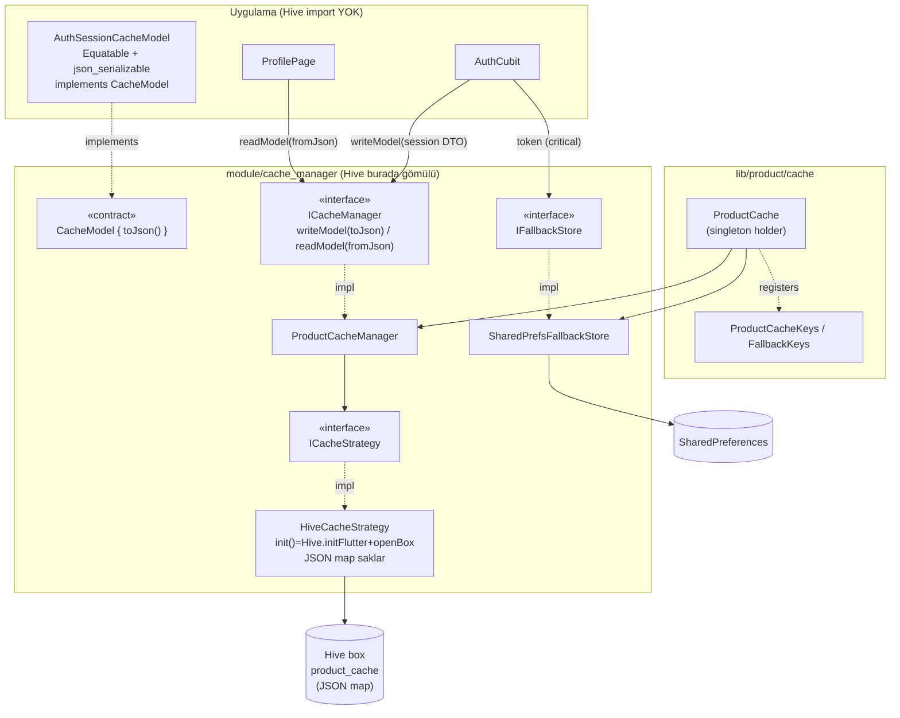
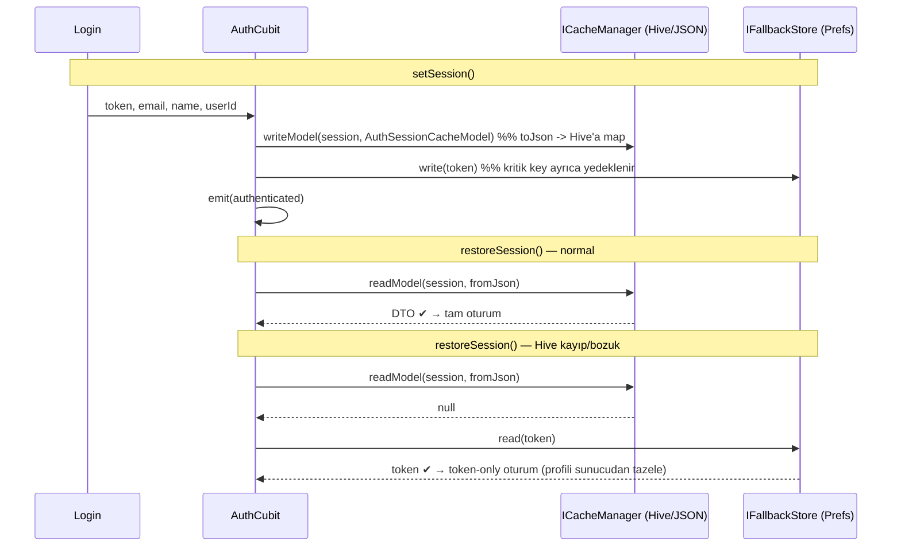

# Cache Manager Mimarisi (v11)

`hive_ce` tabanlı, **model-capable** cache — ama Hive tamamen `cache_manager`
package'ının **içine gömülü** (app hiç Hive import etmez). Modeller **JSON DTO**
olarak saklanır (`CacheModel` contract'ı). Strategy pattern'in **dışında** duran
bağımsız bir **fallback store** birkaç kritik key'i (auth token) yedekler.

Üç ilke:
- **Ana cache = Hive (gömülü)** → primitive + `writeModel`/`readModel`. Modeller
  JSON map olarak saklanır; adapter/typeId yok.
- **Fallback = SharedPreferences** → strategy dışında, string-only, sadece kritik
  key'ler; Hive çökerse hayatta kalan güvenlik ağı.
- **DTO pattern** → cache modelleri saf Dart (Equatable + immutable +
  json_serializable + `CacheModel`); domain/state (AuthState) storage'dan bağımsız.

---

## 1. Katman Diyagramı

**Kilit fikirler:**
- `IFallbackStore` bir `ICacheStrategy` **değildir** — cache boru hattının dışında.
- Hive sadece package içinde; app `CacheModel` + JSON üzerinden konuşur.
- `fromJson` factory olduğu için interface ile zorlanamaz → `readModel`'e param geçilir.

---

## 2. Yazma / Okuma Akışı (fallback davranışı)

---

## 3. Dosya Haritası

| Katman | Dosya |
|--------|-------|
| Interface (app cache) | `module/cache_manager/lib/src/i_cache_manager.dart` |
| Impl | `.../src/product_cache_manager.dart` |
| Model contract | `.../src/model/cache_model.dart` (`CacheModel { toJson() }`) |
| Key modeli | `.../src/model/cache_key.dart` (Equatable) |
| Strategy | `.../src/strategy/i_cache_strategy.dart` + `hive_cache_strategy.dart` |
| Fallback (bağımsız) | `.../src/fallback/i_fallback_store.dart` + `shared_prefs_fallback_store.dart` |
| App holder | `lib/product/cache/product_cache.dart` (Hive import yok) |
| Keyler | `lib/product/cache/product_cache_keys.dart` |
| DTO | `lib/product/cache/model/auth_session_cache_model.dart` (+ `.g.dart`) |
| DI | `lib/product/container/product_container.dart` |
| Bootstrap | `lib/product/initialize/app_initializer.dart` |
| Codegen script | `scripts/generate_models.sh` |
| Skill/command | `.claude/skills/cache-setup`, `.claude/skills/cache-add-model` |

---

## 4. 🎥 Video Anlatım Notları (nelere değinelim)

**Giriş — problem (1-2 dk)**
- Eski hal: `AuthCubit` + `profile_page` doğrudan `SharedPreferences`, hard-coded
  key'ler, cache mantığı her yerde tekrar. → "neden soyutlama gerek?"

**Tasarım kararı — iki ayrı store (2-3 dk)**
- Neden tek "her şeyi yapan" manager değil? Separation of concerns.
- Hive = zengin veri, SharedPreferences = basit ama bulletproof yedek.
- "Fallback'i strategy'nin **dışına** almak" — neden `IFallbackStore` bir
  `ICacheStrategy` değil.

**Strategy Pattern (2 dk)**
- `ICacheStrategy` → `HiveCacheStrategy`. İleride in-memory/secure strateji
  eklemek ne kadar kolay (network layer ile aynı interface+impl konvansiyonu).

**Local package + bağımlılık gizleme (2-3 dk)**
- `module/cache_manager` neden ayrı package? Bağımsız test, yeniden kullanım.
- **Hive'ın package'a gömülmesi:** app'te tek bir `hive` import'u bile yok —
  `Hive.initFlutter` strategy'nin `init()`'inde. "Üst proje storage backend'ini
  bilmez" — güzel bir mimari mesaj.

**DTO + CacheModel contract (2-3 dk)**
- `writeModel` neden `toJson`'ı **zorlar** (contract), `readModel` neden
  `fromJson`'ı **parametre** alır (Dart'ta factory zorlanamaz — öğretici nokta).
- Domain/state (AuthState) vs persistence DTO (AuthSessionCacheModel) ayrımı.
- Modeller neden **daima Equatable + immutable + json_serializable**.
- Hive'ın JSON map saklaması → adapter/typeId yok, projede zaten olan
  json_serializable yeniden kullanılıyor. (Önceki adapter/double-register
  tuzağından nasıl kurtulduğumuzu da anlatabilirsin.)

**Entegrasyon (2 dk)**
- `ProductCache.init()` → `manager.init()` (Hive içeride) → `fallback.init()`.
- DI kaydı (consumer'dan önce), `AppInitializer` bootstrap sırası.
- `AuthCubit` refactor: 4 key → 1 DTO + token yedeği. `restoreSession` iki yolu.

**Test (2 dk)**
- Mock kütüphanesi olmadan hand-rolled `FakeCacheStrategy` + `CacheModel` fake.
- Fallback store testi (`setMockInitialValues`), Hive testi (`Hive.init(tempDir)`
  + box inject → `initFlutter` bypass).
- Testlerin ne kanıtladığı: JSON round-trip, primitive'ler, remove/clear.

**Otomasyon / DX (1 dk)**
- `scripts/generate_models.sh` demosu (json_serializable).
- `/cache-setup` ve `/cache-add-model` skill'leri: mimariyi tek komutla üretme +
  yeni DTO besleme.

**Kapanış (30 sn)**
- Kapsam dışı: `flutter_secure_storage` (v16), sadece token fallback. İleride
  başka strateji (secure) veya kritik modelleri de fallback'leme nasıl eklenir.
